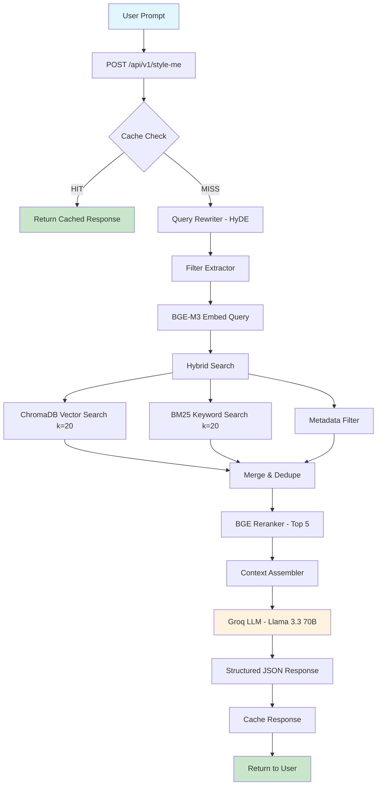

# Quickeee - Architecture

## System Overview

A RAG-powered fashion concierge that scrapes H&M + Myntra, stores products in a hybrid search system, and uses an agentic LLM workflow to recommend outfits.

## Tech Stack

| Component | Technology |
|---|---|
| Scraping | Playwright (headless Chromium) |
| Embeddings | BGE-M3 (1024-dim) via sentence-transformers |
| Vector DB | ChromaDB (HNSW cosine index) |
| Document Store | SQLite |
| Keyword Search | rank-bm25 (in-memory BM25Okapi) |
| Reranker | BGE-reranker-v2-m3 (cross-encoder) |
| LLM | Groq API + Llama 3.3 70B |
| Agent Framework | LangGraph (state machine) |
| API | FastAPI |

## Folder Structure

```
quickee/
  src/
    config.py           # Central configuration
    scraper/            # Playwright scrapers for H&M + Myntra
    ingestion/          # Clean, chunk, dedupe, embed pipeline
    storage/            # ChromaDB, SQLite, BM25 wrappers
    query/              # HyDE rewriter, filter builder, hybrid search, reranker, cache
    agent/              # LangGraph state machine, nodes, prompts
    api/                # FastAPI endpoint
  data/
    scraped/            # Raw JSON from scrapers
    chroma/             # ChromaDB persistence
    quickee.db          # SQLite database
  tests/                # Unit tests
```

## Database Schema

### SQLite: `products` table
| Column | Type | Description |
|---|---|---|
| id | TEXT PK | Unique product ID (e.g., hm_tops_001) |
| name | TEXT | Product name |
| price | REAL | Price in INR |
| currency | TEXT | Currency code |
| image_url | TEXT | Product image URL |
| category | TEXT | "tops" or "bottoms" |
| sub_category | TEXT | "t-shirt", "shirt", "pants", "shorts" |
| color | TEXT | Product color |
| description | TEXT | Product description |
| source | TEXT | "h&m" or "myntra" |
| scraped_at | TEXT | ISO timestamp |
| raw_json | TEXT | Full product JSON |

### SQLite: `cache` table
| Column | Type | Description |
|---|---|---|
| query_hash | TEXT PK | SHA-256 of normalized query |
| response | TEXT | JSON response |
| created_at | REAL | Unix timestamp |

### ChromaDB: `products` collection
- Vectors: 1024-dim BGE-M3 embeddings
- Metadata: id, name, price, category, sub_category, color, source, image_url
- Documents: Searchable text (name + category + color + description)

## State Management

LangGraph manages state through a TypedDict (`AgentState`) that flows through the graph:
1. User query enters
2. Cache check (SHA-256 hash of normalized query)
3. HyDE query rewriting (Groq LLM)
4. Filter extraction (Groq LLM)
5. Query embedding (BGE-M3)
6. Hybrid search (ChromaDB ANN + BM25)
7. Cross-encoder reranking (BGE-reranker-v2-m3)
8. Context assembly
9. Fashion recommendation (Groq LLM)
10. Cache response and return

## Prompt Optimization / Frugal Mindset

1. **Semantic Cache**: SHA-256 hash-based cache in SQLite with configurable TTL. Identical queries return cached responses without any LLM calls.
2. **Minimal LLM calls**: Only 3 LLM calls per uncached query (HyDE rewrite, filter extraction, final recommendation). Could be reduced to 2 by combining HyDE + filter extraction.
3. **Temperature control**: Low temperature (0.3) for recommendations to reduce token waste from creative rambling.
4. **Max token limits**: Hard caps on all LLM calls (200 for rewrite/filters, 1000 for recommendation).
5. **Local models for heavy lifting**: Embedding (BGE-M3) and reranking (BGE-reranker) run locally — no API costs.

## System Flow (Mermaid)


