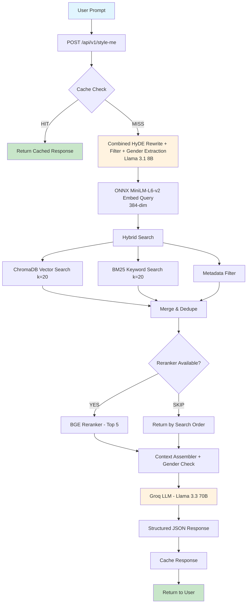

# Quickeee - Architecture

## System Overview

A RAG-powered fashion concierge that scrapes Flipkart + Myntra, stores products in a hybrid search system, and uses an agentic LLM workflow to recommend outfits.

## Tech Stack

| Component | Technology |
|---|---|
| Scraping | Playwright (headless Chromium) |
| Embeddings | ONNX MiniLM-L6-v2 (384-dim) via ChromaDB default, with BGE-M3 (1024-dim) fallback |
| Vector DB | ChromaDB (HNSW cosine index) |
| Document Store | SQLite |
| Keyword Search | rank-bm25 (in-memory BM25Okapi) |
| Reranker | BGE-reranker-v2-m3 (cross-encoder) with skip mode fallback |
| LLM | Groq API — Llama 3.1 8B (rewrite) + Llama 3.3 70B (recommendation) |
| Agent Framework | LangGraph (state machine) |
| API | FastAPI (serves API + luxury frontend) |

## Folder Structure

```
quickee/
  src/
    config.py           # Central configuration
    scraper/            # Playwright scrapers for Flipkart + Myntra
    ingestion/          # Clean, chunk, dedupe, embed pipeline
    storage/            # ChromaDB, SQLite, BM25 wrappers
    query/              # Combined HyDE rewriter + filter extractor, hybrid search, reranker, cache
    agent/              # LangGraph state machine, nodes, prompts
    api/                # FastAPI endpoint + frontend
  data/
    scraped/            # Raw JSON from scrapers
    chroma/             # ChromaDB persistence
    quickee.db          # SQLite database
  tests/                # Unit tests
```

## Database Schema

### SQLite: `products` table
| Column | Type | Description |
|---|---|---|
| id | TEXT PK | Unique product ID (e.g., flipkart_tops_001) |
| name | TEXT | Product name |
| price | REAL | Price in INR |
| currency | TEXT | Currency code |
| image_url | TEXT | Product image URL |
| category | TEXT | "tops" or "bottoms" |
| sub_category | TEXT | "t-shirt", "shirt", "pants", "shorts" |
| color | TEXT | Product color |
| description | TEXT | Product description |
| source | TEXT | "flipkart" or "myntra" |
| scraped_at | TEXT | ISO timestamp |
| raw_json | TEXT | Full product JSON |

### SQLite: `cache` table
| Column | Type | Description |
|---|---|---|
| query_hash | TEXT PK | SHA-256 of normalized query |
| response | TEXT | JSON response |
| created_at | REAL | Unix timestamp |

### ChromaDB: `products` collection
- Vectors: 384-dim ONNX MiniLM-L6-v2 embeddings (1024-dim if using BGE-M3 fallback)
- Metadata: id, name, price, category, sub_category, color, source, image_url
- Documents: Searchable text (name + category + color + description)

## State Management

LangGraph manages state through a TypedDict (`AgentState`) that flows through the graph:
1. User query enters
2. Cache check (SHA-256 hash of normalized query)
3. Combined HyDE query rewriting + filter extraction + gender detection (Groq LLM — Llama 3.1 8B)
4. Query embedding (ONNX MiniLM-L6-v2, 384-dim)
5. Hybrid search (ChromaDB ANN + BM25 + metadata filter)
6. Cross-encoder reranking (BGE-reranker-v2-m3, skipped on Render free tier)
7. Context assembly with gender-aware flagging
8. Fashion recommendation (Groq LLM — Llama 3.3 70B)
9. Cache response and return

## Prompt Optimization / Frugal Mindset

1. **Semantic Cache**: SHA-256 hash-based cache in SQLite with configurable TTL. Identical queries return cached responses without any LLM calls.
2. **Minimal LLM calls**: Only 2 LLM calls per uncached query — one merged HyDE rewrite + filter extraction call (8B fast model), one final recommendation call (70B model).
3. **Temperature control**: Low temperature (0.3) for recommendations to reduce token waste from creative rambling.
4. **Max token limits**: Hard caps on all LLM calls (200 for rewrite/filters, 1000 for recommendation).
5. **Local models for heavy lifting**: Embedding (ONNX MiniLM-L6-v2) runs locally bundled in ChromaDB — no API costs.
6. **Graceful degradation**: Reranker skips on Render free tier (HuggingFace API unreachable), embeddings fall back to local ONNX. App remains fully functional.

## Gender Awareness

The combined rewrite+filter LLM call extracts gender from context clues ("girlfriend", "him", "her", "female", etc.). If the user requests women's clothing but only men's items exist (or vice versa), the stylist note flags the mismatch instead of force-recommending wrong products.

## API Endpoints

| Endpoint | Method | Description |
|---|---|---|
| `/` | GET | Serves luxury frontend UI |
| `/api/v1/style-me` | POST | Main styling endpoint |
| `/health` | GET | Health check for Render |

## System Flow (Mermaid)


